# Permx

Iniciando con un escaneo de puertos y servicios me encontre con los 2 siguientes resultados\

<figure>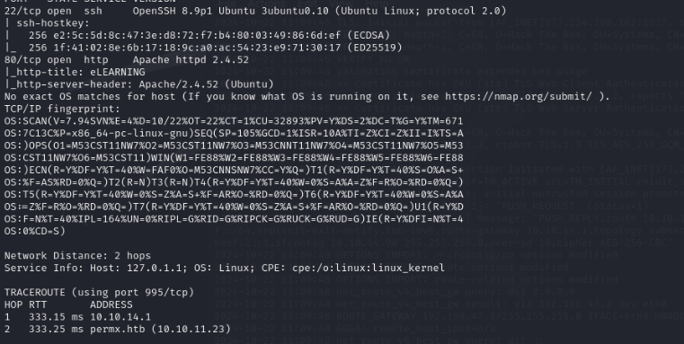<figcaption></figcaption></figure>

En el escaneo se encuentra un dominio: permx.htb\
El cual prosigo a agregar al archivo /etc/hosts para poder acceder al mismo\

<figure><figcaption></figcaption></figure>

Parece que el sitio web en el puerto 80 es bastante simple y estático, sin elementos interactivos como enlaces, formularios o páginas de inicio de sesión. Incluso al revisar el código fuente no se encuentra nada relevante. Dado que no hay un exploit público para la versión de SSH, tal vez valga la pena profundizar en otras áreas del servidor o intentar identificar vulnerabilidades no evidentes en el sitio.

Comienzo a hacer fuzzing de directorios, reviso los resultados y veo si aparece algo interesante que pueda investigar más a fondo

<figure>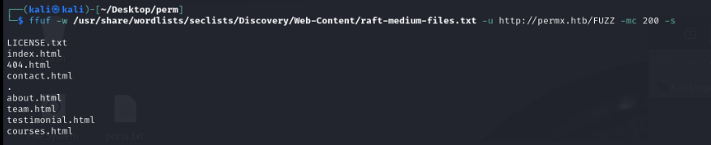<figcaption></figcaption></figure>

No encontre nada relevante por lo que prosegui a realizar fuzzing de subdominios, logrando dar con un resultado posiblemente util

<figure>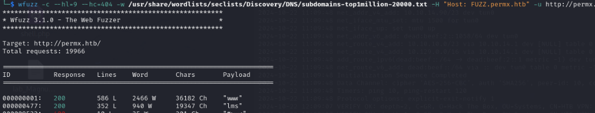<figcaption></figcaption></figure>

Prosigo a agregar el resultado del fuzzing  de subdominios a mi archivo /etc/hosts y repito los pasos realizados con el primer dominio y me encontré con un panel de login&#x20;

<figure>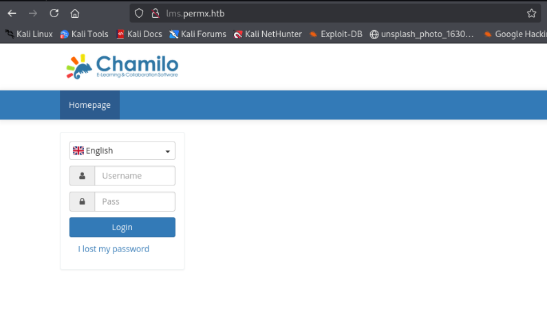<figcaption></figcaption></figure>

Mientras dejaba corriendo un fuzzing de directorios en el dominio, me puse a probar diferentes métodos para vulnerar el panel de login. Intenté con algunas credenciales predeterminadas, ataques de fuerza bruta e inyecciones SQL, entre otros, pero no tuve éxito con ninguno. Decidí entonces revisar nuevamente los resultados del fuzzing

<figure>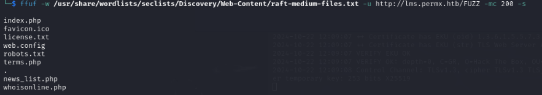<figcaption></figcaption></figure>

Encontrandome con el directorio robots.txt expuesto

<figure>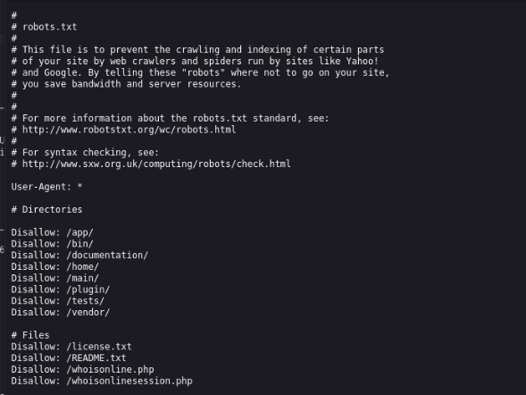<figcaption></figcaption></figure>

Despues de revisar los directorios, en /documentation me encontre con la version de CMS:\
Chamilo 1.11

<figure>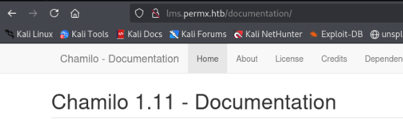<figcaption></figcaption></figure>

Busqué el exploit en Google y encontré un repositorio\

<figure>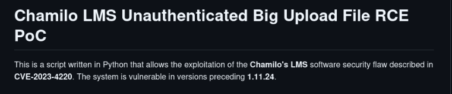<figcaption></figcaption></figure>

<figure>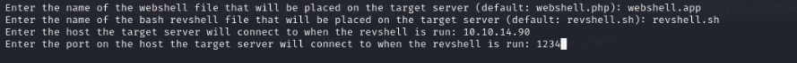<figcaption></figcaption></figure>

<figure>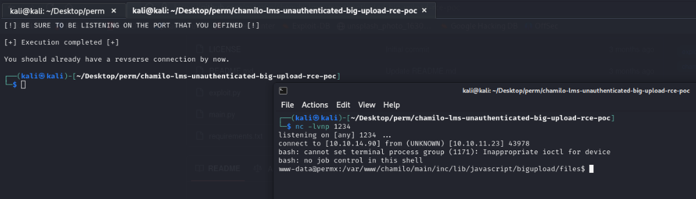<figcaption></figcaption></figure>

Logrando así obtener acceso al usuario www-data.\
Prosigo a hacer que mi shell sea mas estable

script /dev/null -c bash\
ctrl +z\
stty raw -echo; fg\
reset xterm\
export TERM=xterm\
export SHELL=bash

Una vez realizado el tratamiento de la TTY\
Después de investigar un poco, encontre las credenciales de la base de datos\
db\_user: chamilo\
db\_password: 03F6lY3uXAP2bkW8

<figure>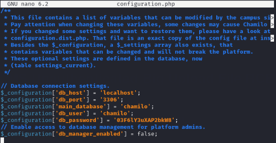<figcaption></figcaption></figure>

Continue investigando y dentro del directorio /home se ve la existencia del directorio del usuario mtz

<figure>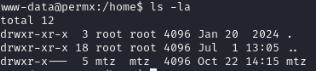<figcaption></figcaption></figure>

Al intentar acceder me solicita la credencial del usuario, inicialmente probe con el contenido que encontre al inicio del acceso&#x20;

<figure>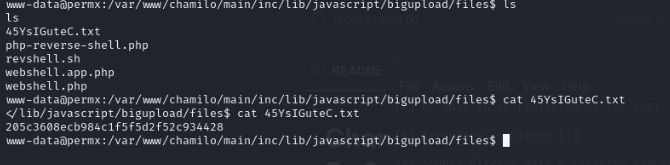<figcaption></figcaption></figure>

Pero no tuve exito con esa posible contraseña.\
Se me ocurrio evaluar la posibilidad de un descuido muy comun por parte de los usuarios el cual es la reutilizacion de contraseñas, asi que decidi optar por probar la contraseña encontrada en el archivo configuration.php con el usuario mtz

<figure><figcaption></figcaption></figure>

Logrando asi tener exito y pudiendo entrar al directorio mtz, donde pude encontrar la primer flag, la flag de usuario.

Ahora toca realizar la escalacion de privilegios

<figure>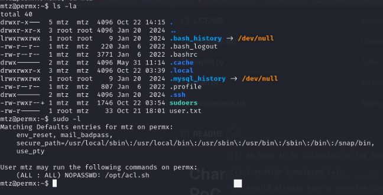<figcaption></figcaption></figure>

Intenté verificar qué permisos tenía y vi un archivo en la carpeta /opt, por lo que me puse a ver que hacia el archivo

\

<figure>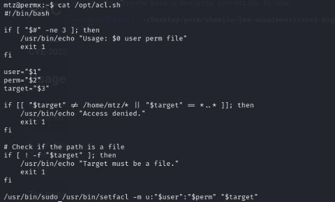<figcaption></figcaption></figure>

Es un programa que tiene 3 permisos donde dice que para el usuario **mtz** puede agregar cualquier permiso pero la ruta tiene que ser y el objetivo debe ser un archivo. Pero en mtz no habia nada que pudiese utilzar.\
Si creamos un **enlace simbólico** con el archivo, podria editarlo desde el directorio mtz

<figure>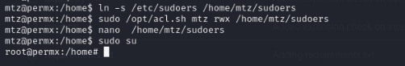<figcaption></figcaption></figure>

Logrando asi, la escalacion de privilegios y obteniendo la ultima flag del usuario root

<figure>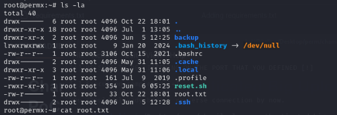<figcaption></figcaption></figure>
